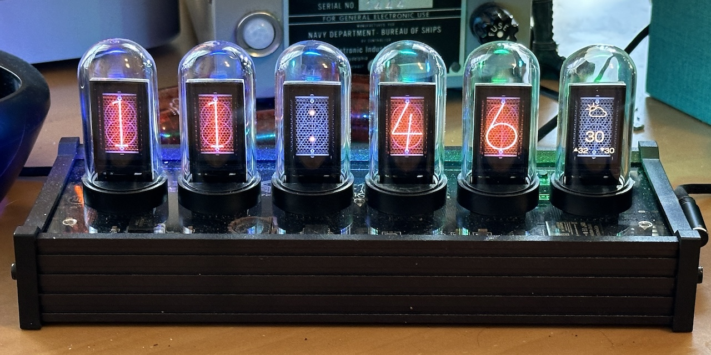
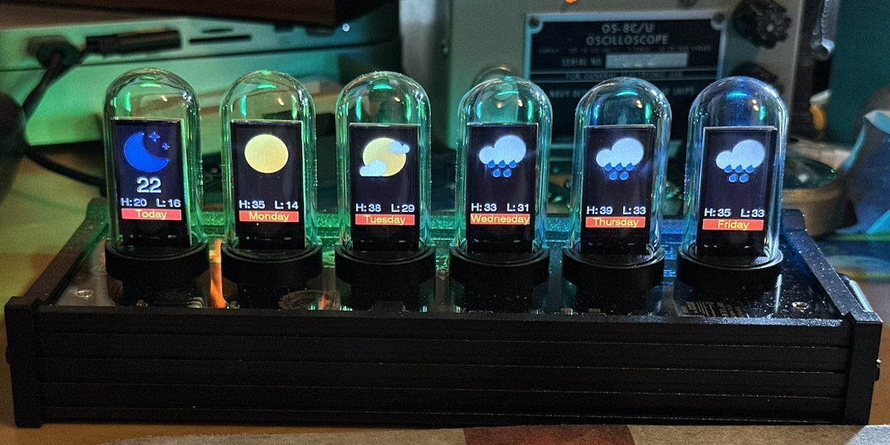
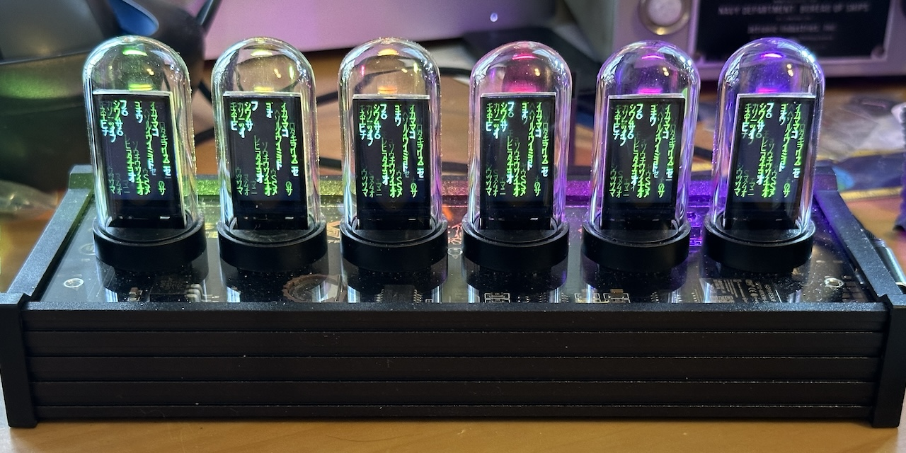

# A Custom Firmware for the EleksTube IPS V1 clock

## Features of This Firmware

This firmware uses the WiFi support that your clock already has to sync the time with the internet and to provide an easy way to configure the clock and change the display:

* It can display the time, the date or a weather forecast.
* It synchronizes the time with NTP so it is very accurate.
* It automatically handles timezone and DST conversions.
* All clock configurarion is done using a web interface.
  * Set the timezone information
  * Set the hours the clock is on
  * Switch between a six digit clock showing seconds and a four digit AM/PM display
  * Enable/disable leading zeros
  * Switch the display between time, date and the weather
  * Set the date format
  * Set the backlight effects and colors
  * Upload, delete and select the images used for the clock display
  * Configure the weather forecast
  * Upload, delete and select the icons used for the weather display
* Clock faces and weather icons can be selected using the buttons.
* You can switch between time, date and weather using the buttons.
* It has a screen saver.
* There is also a tool to convert images in to a format that can be displayed on the clock
* It can connect to a MQTT broker, primarily to allow use of movement and luminance sensors. The full state of the clock is published too.
* The displayed number can be overwritten via MQTT, e.g. to implement automated counters (Custom format: numbers 0-9, ':', ' ' and '_' can be used in a custom string)
* There are specific variants for:
  * The [EleksTube v1 clock](https://www.nixies.us/projects/elekstubeips-clock/elekstube-ips-v1/)
  * The [Si Hai](https://www.nixies.us/projects/elekstubeips-clock/elekstube-ips-v1-3/) clock
  * The [NovelLife SE](https://www.nixies.us/projects/elekstubeips-clock/elekstube-ips-v1-2/) clock
  * The [PCBWay 'Punkcyber'](https://www.nixies.us/projects/elekstubeips-clock/elekstube-ips-v1-4/) clock
  * The [IPSTube](https://www.nixies.us/projects/elekstubeips-clock/elekstube-ips-v1-2-2/) clock

This image shows the clock running in 4 digit mode with weather forecast

This shows a weather forecast using colored icons:

This shows the digital rain screen saver:

## Documentation

See [the wiki](https://github.com/judge2005/EleksTubeIPS/wiki "wiki") for detailed information on how to build, install and use this firmware.

* [Installation](https://github.com/judge2005/EleksTubeIPS/wiki/Installation) takes you through backing up the original firmware, building the custom firmware and uploading it to the clock
* [Connecting to WiFi](https://github.com/judge2005/EleksTubeIPS/wiki/Connecting-to-WiFi) takes you through getting your clock connected to your router so it can sync the time with NTP and you can configure it using a web browser.
* [User Guide](https://github.com/judge2005/EleksTubeIPS/wiki/User-Guide) shows you how to configure and control your clock.
* [Image Collections](https://github.com/judge2005/EleksTubeIPS/wiki/Image-Collections) tells you how to prepare new clock faces and weather icon sets so that they can be uploaded to the clock and used.
* [Hardware Modification](https://github.com/judge2005/EleksTubeIPS/wiki/Hardware-Modification) details a mod that you might want to make to your clock, but only if you are comfortable wielding a soldering iron.

## Credits

[Original documentation and software from EleksMaker.](https://wiki.eleksmaker.com/doku.php?id=ips)

This code wouldn't exist without the work done by the people on [this reddit discussion](https://www.reddit.com/r/arduino/comments/mq5td9/hacking_the_elekstube_ips_clock_anyone_tried_it/).
